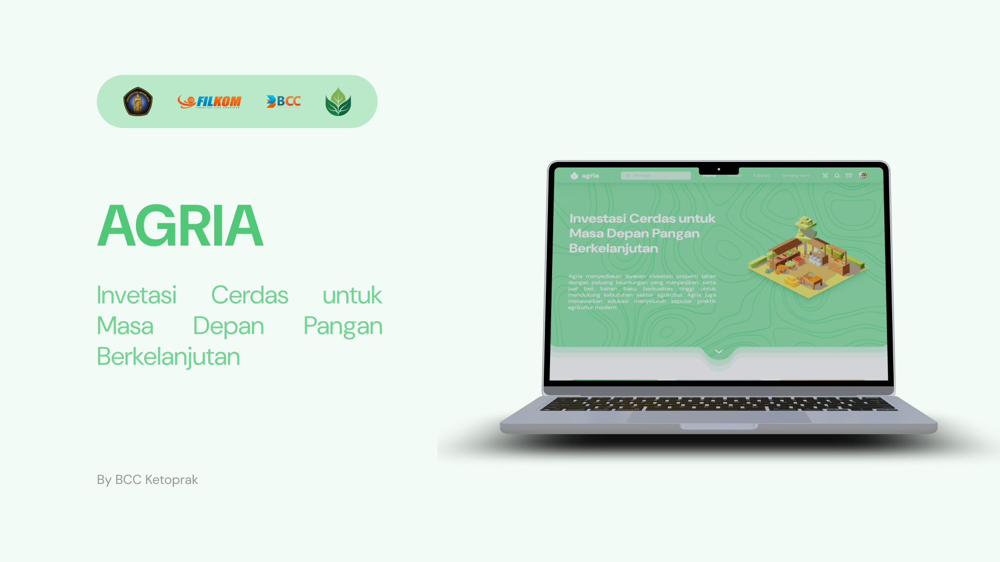

# Agria

A website that provides land rental services, centralized buying and selling of raw materials, and agricultural education features to support the development of the agricultural industry more effectively and efficiently.

By BCC Ketoprak

## 📑 Index

- [📑 Index](#-index)
- [📕 Overview](#-overview)
- [📖 Features](#-features)
- [⚡ Getting Started](#-getting-started)
  - [👾 Installation](#-installation)
  - [🦿 Running the Application](#-running-the-application)
- [🔧 Development](#-development)
- [⚙ Tech Stack](#-tech-stack)
- [📂 Repository Structure](#-repository-structure)
  - [🔩 Our Code Repository](#-our-code-repository)
- [📌 Live Demo](#-live-demo)
- [🧩 Figma](#-figma)
- [🌟 Credit](#-credit)
- [🔒 License](#-license)

## 📕 Overview

AgriaLand is designed to simplify the management of agricultural operations by offering three core services:
1. A streamlined *land leasing system* for farmers and agribusiness owners.
2. A secure, centralized platform for *raw material trading*.
3. Access to valuable *educational resources* to enhance farming knowledge and skills.

## 📖 Features
This application is designed to streamline agricultural operations by offering essential services in land leasing, raw material trading, and education, catering to three different needs.

1. Land Leasing (For Farmers and Agribusiness Owners): 

    * Our platform simplifies the process of leasing agricultural land, allowing users to browse and book available land easily based on their specific requirements.

2. Raw Material Trading (For Agribusiness Suppliers and Buyers): 

    * Centralized Marketplace. A secure and centralized system for buying and selling agricultural raw materials, managed by Agria to ensure quality and availability.
  
    * Simplified Transactions. A seamless process for negotiating, purchasing, and managing deliveries of raw materials.

3. Agricultural Education (For Anyone Interested in Learning): 

    * Educational Resources. Access a variety of resources and courses on agricultural techniques, sustainability, and best practices to improve farming knowledge and skills.

## ⚡ Getting Started

To run this project locally, follow the steps below:

### 👾 Installation

1. Clone the repository:
   ```
   bash
   $ git clone https://github.com/Einrafh/Agria
   ```

2. Navigate into the project directory:
   ```
   bash
   $ cd Agria
   ```

3. Install the required dependencies:
   ```
   bash
   $ npm install
   ```

4. Install additional packages for routing and API handling:
   ```
   bash
   $ npm install react-router-dom
   $ npm install axios
   ```

### 🦿 Running the Application

1. To start the development server, use the command:
   ```
   bash
   $ npm run dev
   ```

2. For building the application for production:
   ```
   bash
   $ npm run build
   ``` 

## 🔧 Development

Here is a description of our application's development process.

## ⚙ Tech Stack

### FrontEnd
| Technology             | Purpose                                                    |
|------------------------|------------------------------------------------------------|
| *React*                | Frontend framework for building the user interface         |
| *Tailwind CSS*         | For building a responsive and customizable UI              |
| *Vite.js*              | For fast and optimized frontend build tooling              |
| *React Router*         | For managing client-side routing in the frontend           |
| *Axios*                | For making API requests from the frontend to the backend   |
| *React Router DOM*     | For client-side routing between pages                      |

### BackEnd
| Technology     | Purpose                                                                          |
|----------------|----------------------------------------------------------------------------------|
| *Go*           | Backend programming language focused on simplicity, concurrency, and performance |
| *MySQL*        | Relational database management system for efficient data storage and retrieval   |
| *Fiber*        | Web framework in Go for building high-performance, low-memory web applications   |
| *SQLX*         | Go library that enhances SQL database interactions by simplifying queries        |
| *JWT*          | Go implementation of JSON Web Tokens for secure data transmission                |
| *Redis*        | In-memory data structure store used for database, caching, and message brokering |

## 📂 Repository Structure

| No  | File Name        | Details                                                                                                        |
| --- | ---------------- | ---------------------------------------------------------------------------------------------------------------|
| 1   | agria_backend    | A submodule from our Backend repository, you can visit it [here](https://github.com/ahmdyaasiin/agria-backend) |
| 2   | agria_frontend   | A submodule from our FrontEnd repository, you can visit it [here](https://github.com/Einrafh/agria-frontend))  |

### 🔩 Our Code Repository

- [FrontEnd](https://github.com/Einrafh/agria-frontend)
- [BackEnd](https://github.com/ahmdyaasiin/agria-backend)

## 📌 Live Demo
https://agria-pi.vercel.app/

## 🧩 Figma

https://www.figma.com/design/wEakK3EyrCVkDPlz8kN40N/AGRIA?node-id=410-31&t=3zoz2OYh2IUwyfBM-1

## 🌟 Credit

1. Muhammad Rafly Ash Shiddiqi
2. Humaam Ahmad Yaasiin
3. Rashky Rahmadian Jauhara


## 🔒 License

© BCC Ketoprak - 2024
